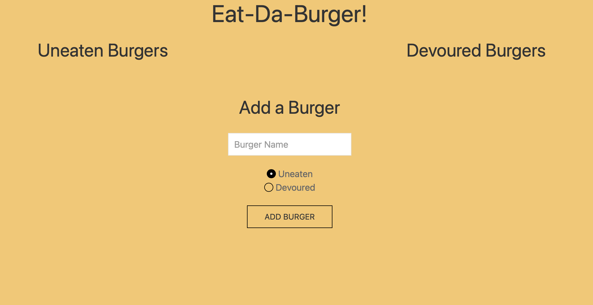

# SMU-Homework-13-Node-Express-Handlebars

## Description

Our thirteenth homework assignment was to create a burger logger with MySQL, Node, Express, Handlebars and a homemade ORM (yum!). The final product is deployed [here](https://emu-homework-13.herokuapp.com).

## Installation

Clone the repo, then run `npm i`.

## Usage

## License

This content can be reused for personal educational purposes only. No commerical use is authorized.
